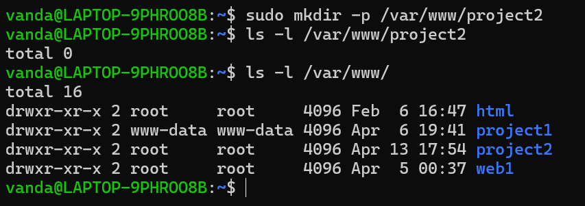
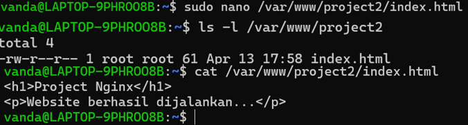
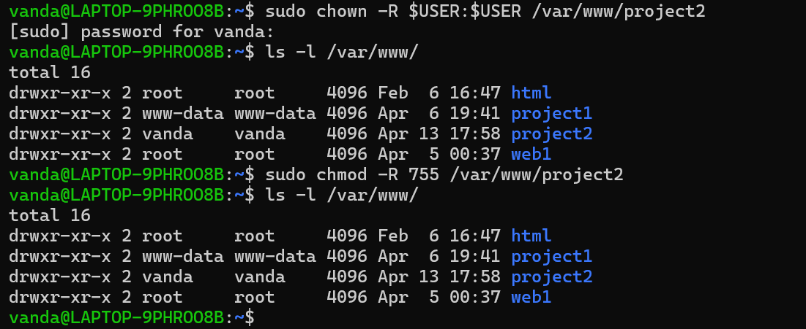
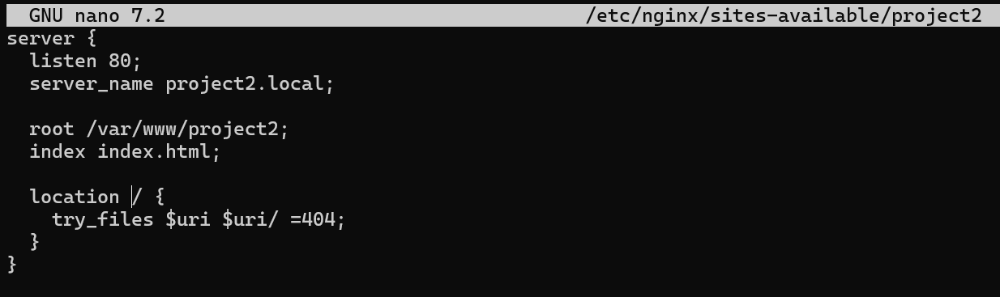
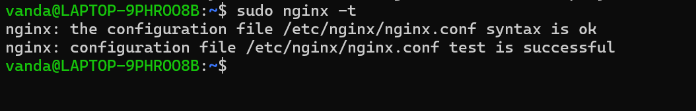
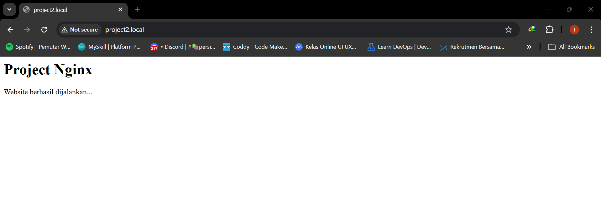

# 🐧 Project 2: Hosting Website Menggunakan NGINX Di WSL

## 📌 Deskripsi 
Project ini berfokus pada implementasi web server NGINX, mulai dari instalasi, konfigurasi virtual host, hingga deployment website sederhana. 

Simulasi dilakukan menggunakan WSL untuk merepresentasikan environment server Linux secara lokal.

---

## 🖥️ Environment
- OS : Windows 11
- Virtual Environmnet : WSL (Windows Subsystem for Linux)
- Linux Distro : Ubuntu
- Web Server : NGINX

---
## 🎯 Tujuan
- Menginstall dan menjalankan nginx
- Membuat website sederhana menggunakan HTML
- Mengkonfigurasi virtual host
- Mengakses website menggunakan domail lokal

---

## ⚙️ Langkah-Langkah

### 1. Update System
### Command :
```bash
sudo apt update
sudo apt upgrade -y
```

### 2. Install Nginx
### Command :
```bash
sudo apt install nginx -y
```

### 3. Cek Status Nginx
### Command :
```bash
sudo service nginx status
```

### Eksekusi Command di Terminal :


### 4. Membuat Folder Website
### Command :
```bash
sudo mkdir -p /var/www/project2
```

### Eksekusi Command di Terminal :


### 5. Membuat File HTML
### Command :
```bash
sudo nano /var/www/project2/index.html
```
### Isi File
```bash
<h1>Project Nginx - Vanda</h1>
<p>Website berhasil dijalankan....</p>
```

### Eksekusi Command di Terminal :


### 6. Mengatur Permission
### Command :
```bash
sudo chown -R $USER:$USER /var/www/project2
sudo chmod -R 755 /var/www/project2
```

### Eksekusi Command di Terminal :


**Penjelasan :**
- **Parameter $USER:$USER /var/www/project2** <br>
  → berarti user yang sedang aktif dijadikan sebagai owner dan group dari folder tersebut
- **Permission 755** <br>
  7 (owner) - read, write, execute <br>
  5 (group) - read, execute <br>
  5 (others) - read, execute


### 7. Konfigurasi Nginx
### Command :
```bash
sudo nano /etc/nginx/sites-available/project2
```
### Isi konfigurasi
```bash
server {
  listen 80;
  server_name project2.local;

  root /var/www/project2;
  index index.html;

  location / {
    try_files $uri $uri/ =404;
  }
}
```

### Eksekusi Command di Terminal :


**Penjelasan :**
- **listen 80** → menentukan server akan berjalan di port 80, yaitu port default untuk HTTP
- **server_name project2.local** → menentukan domain atau nama host yg digunakan untuk mengakses website
- **root /var/www/project2** → menentukan direktori utama tempat file website disimpan
- **index index.html** → menentukan file default yang akan dibuka ketika user mengakses domain tanpa menyebutkan nama file
- **location/** → mengatur bagaimana nginx menangani request ke path / (halaman utama website)
- **try_files $uri $uri/ =404** →
  Mencari file sesuai URL yang diminta
  Jika tidak ada, mencoba sebagai folder
  Jika tetap tidak ditemukan, akan menampilkan error 404 <br>
  
**Kesimpulan :** <br>
Konfigurasi ini digunakan untuk menghubungkan domain (project2.local) dengan folder website di server, sehingga website dapat diakses melalui browser seperti layaknya server di dunia nyata.

### 8. Mengaktifkan Config 
### Command :
```bash
sudo ln -s /etc/nginx/sites-available/project2 /etc/nginx/sites-enabled/
```

### 9. Test Konfigurasi
### Command :
```bash
sudo nginx -t
```

### Eksekusi Command di Terminal


### 10. Restart Nginx
### Command :
```bash
sudo service nginx restart
```

### 11. Konfigurasi Hosts di Windows
### Edit File :
```bash
C:\Windows\System32\drivers\etc\hosts
Tambahkan:
127.0.0.1 project2.local
```

### 12. Akses Website
### Buka browser :
```bash
http://project2.local
```



---

## 📊 Hasil
- Nginx berhasil diinstall dan dijalankan
- Website berhasil dibuat dan diakses
- Domain lokal (project2.local) berhasil digunakan
- Konfigurasi virtual host berjalan dengan baik

---

## 🧠 Insight
- Memahami cara kerja web server nginx
- Menetahui konsep virtual host
- Memahami hubungan antara domai dan server
- Mampu melakukan deployment website sederhana di lingkungan Linux

---
